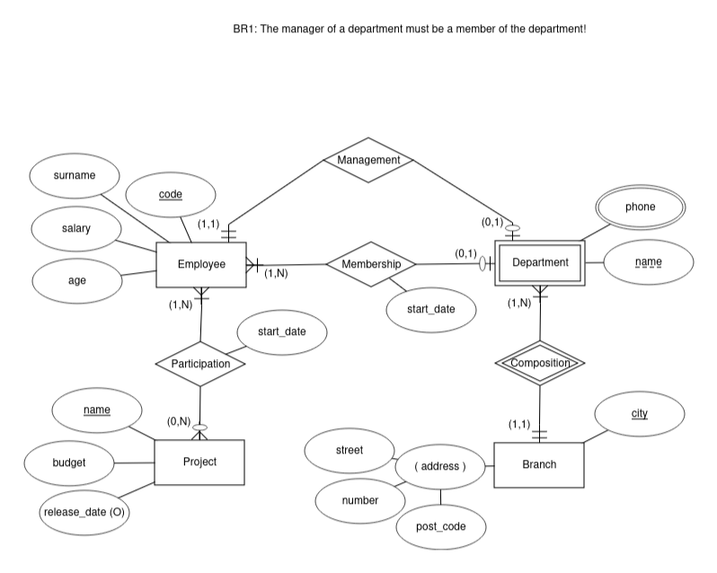
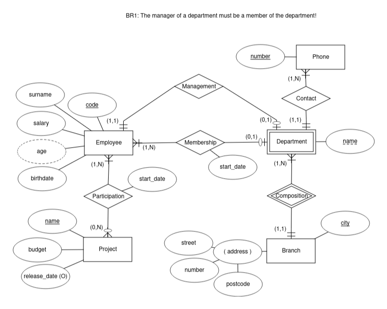

# Translation of E/R diagram to relational schema
Come esempio abbastanza esaustivo di traduzione di una schema E/R si procede alla traduzione dello schema E/R:

Provvediamo a ristrutturare lo schema come visto in [Restructuring an E/R diagram](../restructuring.md).

Considerando che:
* non è opportuno memorizzare l'età di una persona per i problemi di gestione delle variazioni, si introduce nell'entità *Employee* l'attributo birthdate e si rende derivato l'attributo age
* non vi sono gerarchie is-a
* trasformiamo l'attributo multiplo phone ipotizzandolo associato ad un unico dipartimento
* non sembra necessario procedere al partizionamento o alla fusione di entità ed associazioni
* vi sono identificatori che al momento sembrano adeguati
* non vi sono ulteriori considerazioni

Si ottiene lo schema E/R:


Si procede alla traduzione secondo quanto indicato in [# Translation of E/R diagram to relational schema](../translation.md).

## Traduzione delle entità
Nel nostro caso, per l'entità *Project*:
```SQL
CREATE TABLE project (
    -- primary key field(s)
    name VARCHAR(30) COMMENT "Nome",
    -- mandatory fields
    budget DECIMAL(10,2) NOT NULL COMMENT "Budget up to 99.999.999,99",
    -- optional fields (NULL can be omitted)
    release_date DATE NULL DEFAULT NULL COMMENT "Data di rilascio",
    -- CONSTRAINTS:
    -- PRIMARY KEY: implies NOT NULL
    PRIMARY KEY (name),
    -- DOMAIN (optional)
    CHECK(budget > 0.00)
) COMMENT "Table for entity Project";
```

Per l'entità *Branch*:
```SQL
CREATE TABLE branch (
    -- primary key field(s)
    city VARCHAR(30) COMMENT "city",
    -- mandatory fields
    number VARCHAR(10) NOT NULL COMMENT "number",
    street VARCHAR(30) NOT NULL COMMENT "street",
    postcode VARCHAR(5) NOT NULL COMMENT "postcode",
    -- CONSTRAINTS:
    -- PRIMARY KEY: implies NOT NULL
    PRIMARY KEY (city)
) COMMENT "Table for entity Branch";
```

Per l'entità *Employee*:
```SQL
CREATE TABLE employee (
    -- primary key field(s)
    code INT AUTO_INCREMENT COMMENT "matricola",
    -- mandatory fields
    surname VARCHAR(30) NOT NULL COMMENT "surname",
    salary DECIMAL(8,2) NOT NULL COMMENT "salary",
    birthdate DATE NOT NULL COMMENT "nascita",
    -- derived (computed) fields
    -- age INT AS (DATEDIFF(NOW(), birthdate) / 365) VIRTUAL COMMENT "age wrongly computed...",
    age INT AS (YEAR(NOW()) - YEAR(birthdate) - (DAYOFYEAR(NOW()) < DAYOFYEAR(birthdate)) ) VIRTUAL COMMENT "age computed...",
    -- CONSTRAINTS:
    -- PRIMARY KEY: implies NOT NULL
    PRIMARY KEY (code)
) COMMENT "Table for entity Employee";
```

Per l'entità *Department*:
```SQL
CREATE TABLE department (
    -- primary key field(s)
    name VARCHAR(20) COMMENT "Department name",
    branch VARCHAR(30) COMMENT "city branch",
    -- CONSTRAINTS:
    -- PRIMARY KEY: implies NOT NULL
    PRIMARY KEY (name, branch),
    -- FOREIGN KEYS (optional)
    CONSTRAINT PartOfBranch FOREIGN KEY(branch) REFERENCES branch(city)
        ON UPDATE CASCADE ON DELETE NO ACTION
) COMMENT "Table for entity Department";
```

Per l'entità *Phone*:
```SQL
CREATE TABLE phone (
    -- primary key field(s)
    number VARCHAR(10) COMMENT "phone number",
    department VARCHAR(20) COMMENT "Department name",
    branch VARCHAR(30) COMMENT "department city branch",
    -- CONSTRAINTS:
    -- PRIMARY KEY: implies NOT NULL
    PRIMARY KEY (number), -- if a number is unique to a department
    -- PRIMARY KEY (number, department, branch), -- if a number can be shared between departments
    -- FOREIGN KEYS (optional)
    CONSTRAINT BelongsToDepartment FOREIGN KEY(department, branch) REFERENCES department(name, branch)
        ON UPDATE CASCADE ON DELETE NO ACTION
) COMMENT "Table for multiple attribute Phone of entity Department";
```

## Traduzione delle associazioni N:M
Nel nostro caso, per l'associazione *Participation*:
```SQL
CREATE TABLE participation (
    -- primary key field(s)
    employee INT COMMENT "1. 1 Participating employee code",
    project VARCHAR(30) COMMENT "1. 2 Project name",
    -- mandatory fields
    start DATE NOT NULL COMMENT "3. Starting date",
    -- CONSTRAINTS:
    -- PRIMARY KEY: implies NOT NULL
    PRIMARY KEY (employee, project), -- 1. (employee, project) + 2. (empty)
    -- FOREIGN KEYS (optional)
    CONSTRAINT RealEmployee FOREIGN KEY(employee) REFERENCES employee(code)
        ON UPDATE CASCADE ON DELETE NO ACTION,
    CONSTRAINT RealProject FOREIGN KEY(project) REFERENCES project(name)
        ON UPDATE CASCADE ON DELETE NO ACTION
) COMMENT "Table for association Participation";
```

In questo caso l'attributo *start* non è identificante e quindi non entra a far parte della chiave primaria.

Se invece l'attributo avesse, ad esempio, il significato di "data in cui l'employee ha svolto un'attività per il progetto" allora sarebbe identificante (il medesimo employee può svolgere diverse attività in giorni *diversi* per il medesimo progetto) ed entrerebbe a far parte della chiave primaria, come in questa variante:
```SQL
CREATE TABLE participation (
    -- primary key field(s)
    employee INT COMMENT "1. 1 Participating employee code",
    project VARCHAR(30) COMMENT "1. 2 Project name",
    -- mandatory fields
    start DATE NOT NULL COMMENT "2. Working date",
    -- CONSTRAINTS:
    -- PRIMARY KEY: implies NOT NULL
    PRIMARY KEY (employee, project, start), -- 1. (employee, project) + 2. (start)
    -- FOREIGN KEYS (optional)
    CONSTRAINT RealEmployee FOREIGN KEY(employee) REFERENCES employee(code)
        ON UPDATE CASCADE ON DELETE NO ACTION,
    CONSTRAINT RealProject FOREIGN KEY(project) REFERENCES project(name)
        ON UPDATE CASCADE ON DELETE NO ACTION
) COMMENT "Table for association Participation";
```

## Traduzione delle associazioni 1:N
Nel nostro caso, per l'associazione *Membership*:
```SQL
ALTER TABLE employee
    ADD COLUMN department VARCHAR(20) NULL COMMENT "1. Member of Department name",
    ADD COLUMN branch VARCHAR(30) NULL COMMENT "1. Member Department branch",
    ADD COLUMN start DATE NULL COMMENT "2. Membership start date",
    -- CONSTRAINTS:
    ADD CONSTRAINT membershipDepartment FOREIGN KEY(department, branch) REFERENCES department(name, branch)
        ON UPDATE CASCADE ON DELETE NO ACTION,
    -- OPTIONAL FOREIGN KEY MEANINGFUL: (both NULL or none NULL)
    ADD CONSTRAINT DepartmentBranchNULLS CHECK(ISNULL(department) = ISNULL(branch)),
    -- Optional Relationship mandatory attribute MEANINGFUL: (NULL if no participation)
    ADD CONSTRAINT NoStarDateIfNoMembership CHECK(ISNULL(department) = ISNULL(start));
```
In alternativa, qualora:
* l'associazione fosse poco utilizzata (poche operazioni non frequenti)
* la percentuale di istanze (di *Employee*) che partecipano fosse limitata

si potrebbe avere la variante con tabella aggiuntiva:
```SQL
CREATE TABLE membership (
    -- primary key field(s)
    employee INT COMMENT "1. Member employee code",
    -- foreign key field(s)
    department VARCHAR(20) COMMENT "2. Department name",
    branch VARCHAR(30) COMMENT "2. city branch",
    -- mandatory fields
    start DATE NOT NULL COMMENT "Starting date",
    -- CONSTRAINTS:
    -- PRIMARY KEY: implies NOT NULL
    PRIMARY KEY (employee),
    -- FOREIGN KEYS (optional)
    CONSTRAINT RealMember FOREIGN KEY(employee) REFERENCES employee(code)
        ON UPDATE CASCADE ON DELETE NO ACTION,
    CONSTRAINT MemberOfDepartment FOREIGN KEY(department, branch) REFERENCES department(name, branch)
        ON UPDATE CASCADE ON DELETE NO ACTION
) COMMENT "Table (not really needed) for relationship Membership between entities Employee and Department";
```

## Traduzione delle associazioni 1:1
Nel nostro caso, per l'associazione *Management*, visto che:
* la partecipazione di Department è obbligatoria mentre quella di Employee è facoltativa
* la chiave di Department è composta da due attributi alfanumerici mentre quella di Employee è composta da un solo attributo intero

risulta conveniente inserire la chiave di employee all'interno della tabella di department:
```SQL
ALTER TABLE department
    ADD COLUMN manager INT NOT NULL COMMENT "1. Manager employee code",
    -- CONSTRAINTS:
    ADD CONSTRAINT RealManager FOREIGN KEY(manager) REFERENCES employee(code)
        ON UPDATE CASCADE ON DELETE NO ACTION,
    ADD CONSTRAINT OnlyOneDepartmentPerManager UNIQUE(manager);
```

## Eventuali ottimizzazioni/varianti/altri vincoli
Si potrebbe imporre il vincolo riportato come BR1:
> BR1: The manager of a department must be a member of the department!
Forse è possibile imporlo tramite una view (a cui limitare le operazioni di INSERT e UPDATE), ma credo sia più semplice utilizzare un *trigger* in inserimento/aggiornamento.

## Final script
Here's the final script [Company-schema](Company-schema.sql)

A questo punto si dovrebbero inserire dei dati ...
